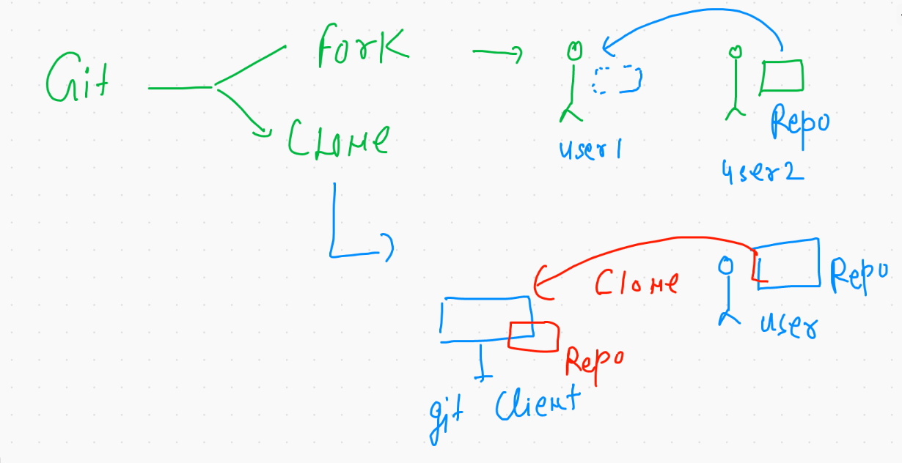

# Git 🦖  : - The Distributed version control system   

 
 
 ## Cheetsheet link 
 
 [CLick](https://github.com/lnbspace/github_tutorial/blob/main/git-cheat-sheet-education.pdf)
 
 
 ## Getting started 
 
 
 
 ##  creating repo its just a cup of team 
 
 
 
 ## Introduction to branches 
 
 
 
 ## Fork vs clone 
 
 
 
 ## LNB rules 
 
 
 
 
 
 
 
 

